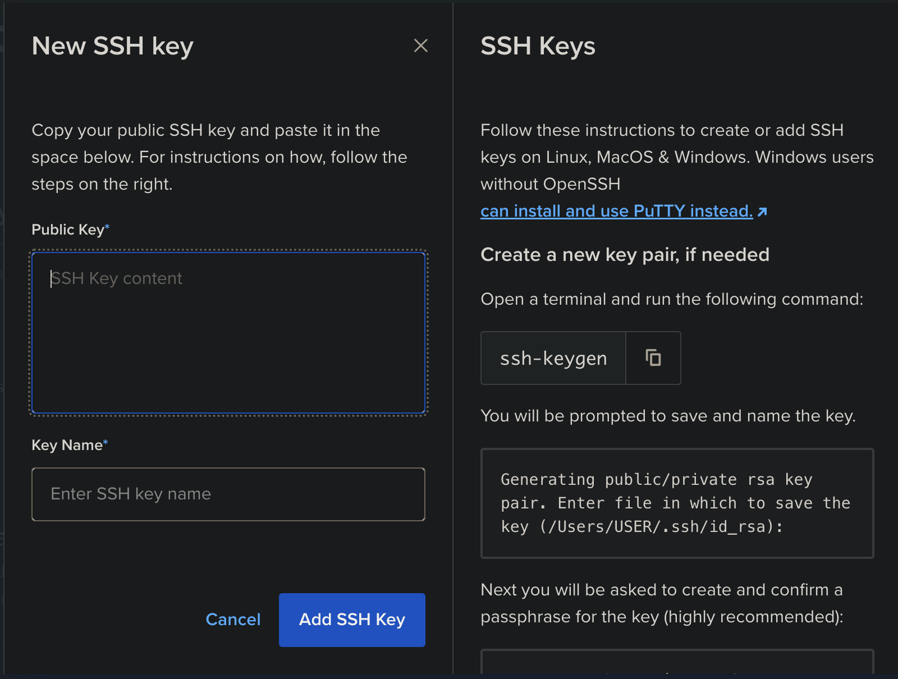
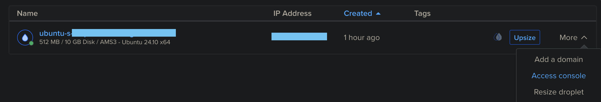
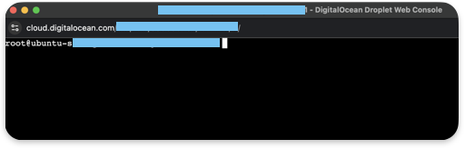
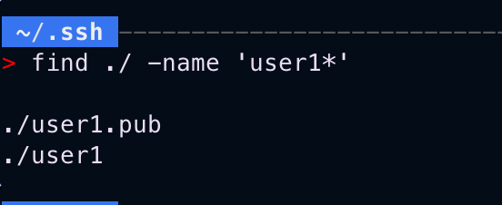

# SSH-Remote-Server-Setup
This is a very simple project where the goal is to demonstrate how to add public SSH keys to a remote server. Project Link: [Here](https://roadmap.sh/projects/ssh-remote-server-setup)

For this project, I am using a droptlet on [Digital Ocean](digitalocean.com).

# Connecting to server
When creating a droplet, you will be asked to provide your public key:



If you don't have one yet, keep reading.

Go to your project droplet and access the console, this will open a new browser window.





You are now connected to your server. Now we need to generate a SSH key pair.

Open a terminal on your local host and type the following command:

```
ssh-keygen
```

When you are asked to provide a path to save your keys, provide a custom path. Ex. `~/.ssh/user1`

Once you hit enter, the keys will be generated.

With the example above, the command will save a pair of public and private keys.

The private key would be saved as `user1` and the public key as `user1.pub`.



We need to add the public key to the droplet. To do so, start by displaying the public key. 

```
cat ~/.ssh/user1.pub
```

Switch back to the remote server and access the authorized key file.
```
nano ~/.ssh/authorized_keys
```

Copy paste the public key, save and quit (ctrl-x, Y, Enter)

You should now be able to connect remotely.

Two requirements:
* Private key path. Ex. `~/.ssh/user1`
* Droplet IP Address

```
ssh -i [private_key_path] root@[ip_address]
```

Press enter and you should be now connected.

Repeat steps to add another key pair.

# Fail2Ban